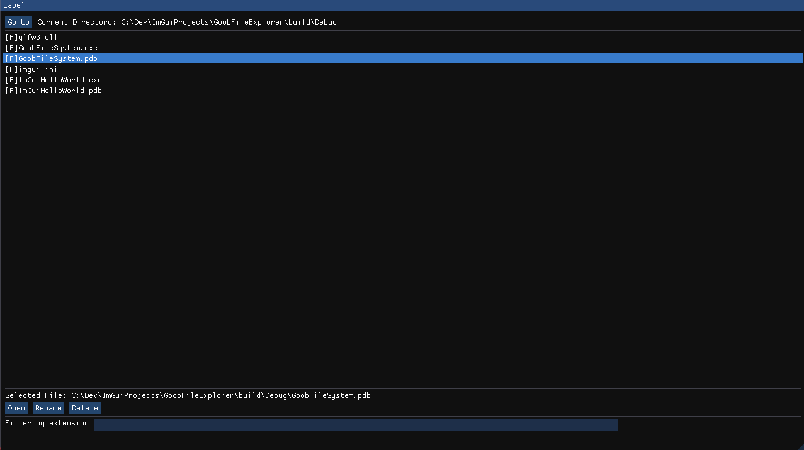

# 🗂️ Simple File Explorer

A minimal file explorer built with C++ and [Dear ImGui](https://github.com/ocornut/imgui), designed to demonstrate basic UI interaction and filesystem operations.

## 🚀 Features

- 📁 Navigate through directories
- 🖱️ Open folders with a click
- 📄 Display files and folders
- 🗑️ Delete files and folders
- ✏️ Rename files and folders
- 🧭 Clean and interactive ImGui interface

## 🛠️ Built With

- **C++**
- **Dear ImGui**
- **C++17/20 Filesystem API** (`std::filesystem`)
- **CMake**

## 📦 Setup & Run

# How to install VCPKG

Official Link: <https://vcpkg.io/en/index.html>

```cmd
git clone https://github.com/Microsoft/vcpkg.git
.\vcpkg\bootstrap-vcpkg.bat # windows
./vcpkg/bootstrap-vcpkg.sh # Unix
```
You Will need to set your installation path of vcpkg in the cmake on this line:
```cmd
set (VCPKG_DIR "C:/Users/User/vcpkg")
```

1. **Clone the repository**
   ```bash
   git clone https://github.com/maxkaiser11/Goob-s-File-Explorer.git
   cd Goob-s-File-Explorer
   ```

2. **Build with CMake**
   ```bash
   mkdir build
   cd build
   cmake ..
   cmake --build .
   ```

3. **Run the executable**
   ```bash
   ./file_explorer
   ```

> ✅ Make sure all dependencies like ImGui, GLFW, and OpenGL are correctly linked via your `CMakeLists.txt`.
>


## 🖼️ Screenshot



## 📄 License

This project is licensed under the MIT License.

